# Digital Storytelling with Adobe Premiere Pro

Adobe Premiere Pro is a full-featured application for non-linear video editing. (Non-linear just means that you can work with clips in any order, without modifying them.) We won't use all of its features in this getting-started tutorial, but we'll learn how to assemble digital stories using videos, photos, titles, and simple audio.

Later, if you'd like to expand your Premiere knowledge, you might be interested in the [books](https://learning.oreilly.com/home/?next=/library/view/Adobe-Premiere-Pro/9781681986883/) or [videos](https://www.linkedin.com/learning/search?keywords=premiere%20pro&amp;u=95316746) available to UCLA students.

Adobe Premiere uses a few terms in specific ways.

1. A **clip** is a length of video.
2. A **sequence** is a series of clips edited together.
3. A **frame** is a specific moment in a clip or sequence.
4. A **timeline** shows the duration of the clip or sequence.
5. A **playhead** is the blue vertical line (it looks like a cursor) that indicates where on a timeline you'd like your video to begin playing.

# 1 Organizing your media

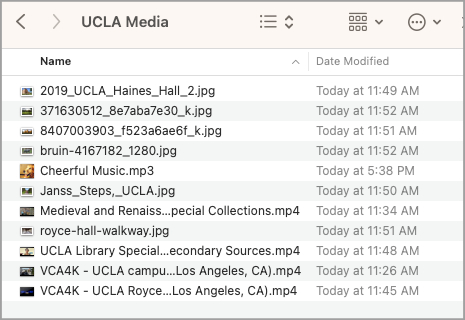

When we're working with video, we spend a bit more time than usual setting up our files and folders. That's because video takes up so much space on your computer that you want to be sure you have enough room for both the original media and for the final product.

It's a good idea to move all the media you plan to work with—audio, video, and photographs—into one folder (or a series of nested folders) either on your computer or on an external hard drive connected to your computer. This makes it easier for Adobe Premiere to find your file. Within your media folder, it's also a good idea to keep your various types of media as organized as you possibly can, in order to avoid confusion. (Remember that you should be keeping track of the sources of your media.)

It's important to understand that when you work with media in Adobe Premiere, you're not really importing your media into the program; you're importing a *reference* to the original file on your computer. Premiere works this way in order to avoid making copies of files that are already pretty large. This also allows you to edit your project without modifying the original files. But it does mean that if you move your media around later, Premiere will get confused and ask you to re-link the media. So it's a good idea to leave your media in its original location until you're done editing your video. 

For this tutorial, I'm going to work with media related to UCLA, which I'll store in a folder on my computer.

# 2 Open Adobe Premiere Pro

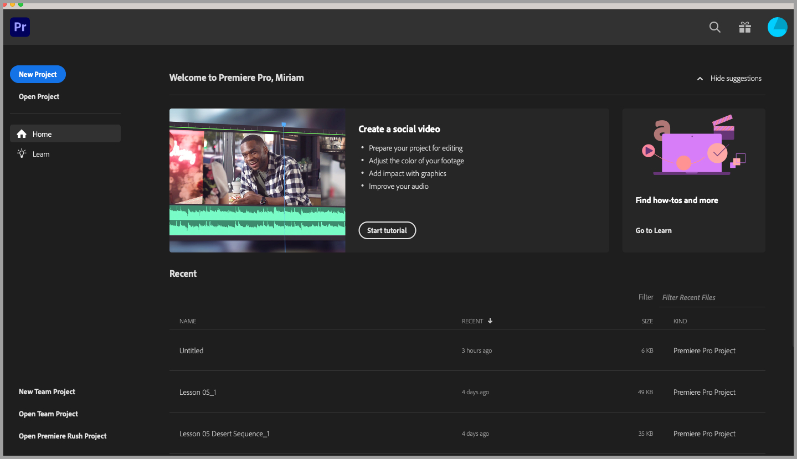

Double-click the Adobe Premiere Pro icon to open the program. You'll be greeted by a welcome screen.

# 3 Create a new project

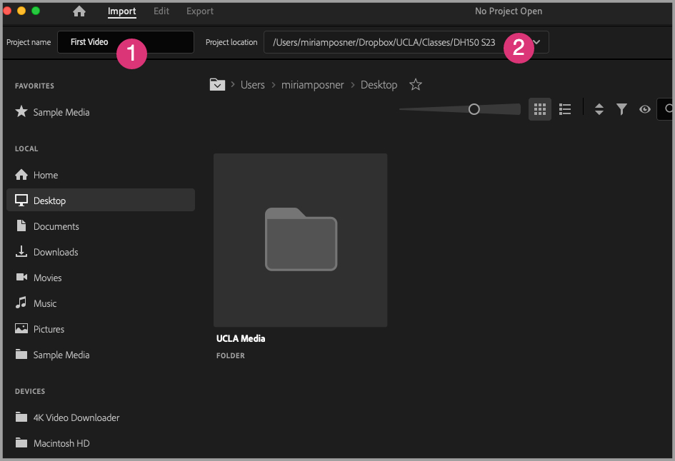

Click on the blue **Create project** button or, from the **File** menu, select **New project**. Choose a name for your project (**1**) and select a location to save your project (**2**).

# 4 Import your media (1)

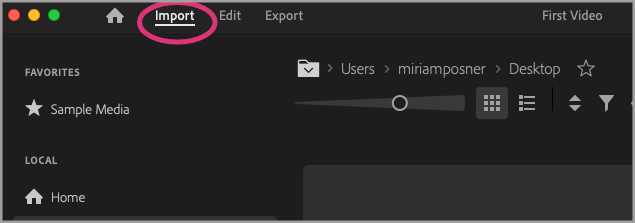

Let's tell Premiere where to look for the media we'll use in our video. Click on the **Import** tab at the top of the Adobe Premiere window.

# 5 Import your media (2)

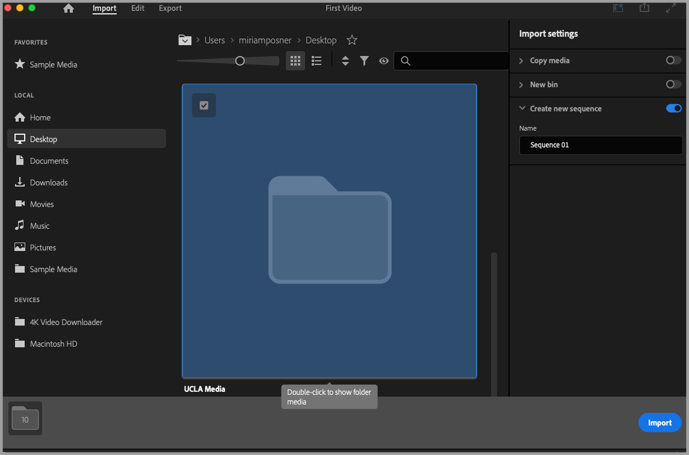

Now, use the icons on the left side of the window to navigate your computer until you locate the file where you've saved your media. (My folder is called **UCLA Media**.) Once you've highlighted the folder, you can click **Import**. 

# 6 Examine the interface

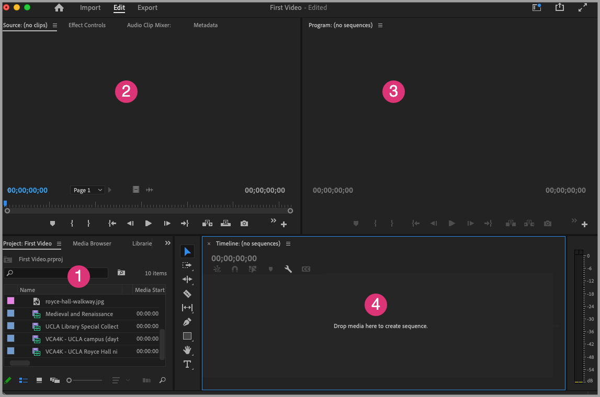

After you've clicked **Import**, Premiere automatically selects the **Edit** tab, so that you see the tools you'll need to edit your video. It can be a bit overwhelming, so let's examine each panel in turn.

1. On the bottom left, you can see your **project panel**. This displays the clips and other media associated with the video you're editing. You'll notice that you can switch to different tabs within the project panel. I find it easiest to sort through clips using the **Project:** tab. This displays all the photos and videos in my project folder. You might also try the **Media Browser** tab, which displays your files slightly differently.
2. On the upper left, you'll find the **source monitor**. This is where you'll view and edit the individual clips as you prepare to drop them into your video project.
3. As you build your video, you can view the sequence in the **program monitor**.
4. You'll do your editing work using the **timeline**. As you add video, sound, and images, you'll build up layers, each of which you can edit individually.

You can always double-click the title of each panel to enlarge it so that it fills the window. Double-click the title again to shrink it back to its original size.

If you click on the **Window** menu and then **Workspaces**, you'll see that Premiere offers a number of alternative ways of arranging the panels and tabs in your Premiere window, designed to correspond with different workflows. We'll be using the **Editing** workspace, but later on you might like to try another workspace, like **Audio**, if you're performing a specific task.

# 7 Open a clip in the source browser

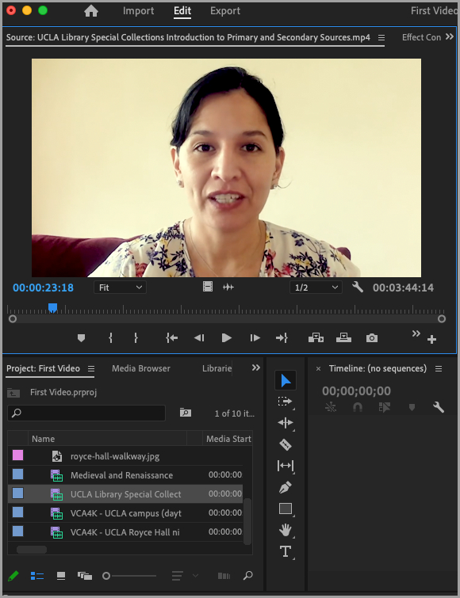

In the project panel, double-click on the icon of one of your video clips to open it in the source monitor. (Remember, the source monitor is where you work with your clips before adding them to the larger project.)

Beneath the video image is a timeline for the source monitor. You'll notice that a blue **playhead** advances along the timeline as the video plays. If you drag the playhead, you'll see that you can advance or rewind through the clip.

If you'd like, you can position your cursor over the image in the source monitor and press the **`** (accent grave) key so that the image fills the window. (This key is located just to the left of the **1** key on most keyboards; press it again to shrink the image back to its usual size.)

# 8 Select a range from your source clip

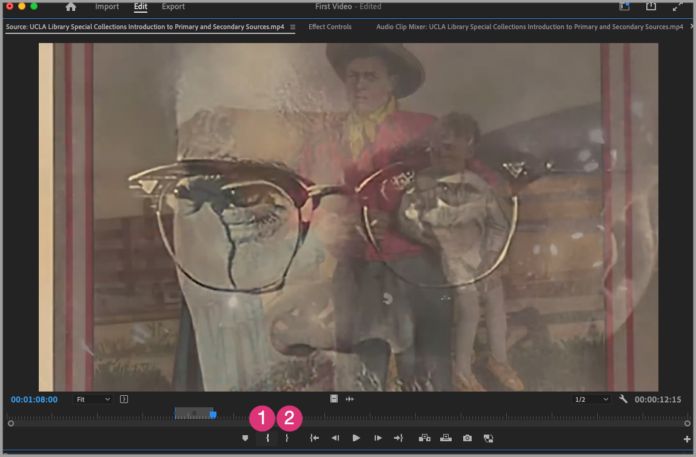

To prepare our clip, we'll **mark** it in order to select the range of video we want to use in the main project. Marking a clip doesn't cut it or change it; it's a bit like a note, indicating that you want something to happen at that point.

In order to designate the range of source video we want to use, we'll use the **Mark in** and **Mark out** buttons. These indicate the section of the video we want to include in the larger sequence. You can add as many markers as you want, but each clip can have only one **Mark in** and one **Mark out** marker at a time. If you select the **mark in** and **mark out** buttons again on the same clip, you'll overwrite the previous markers.

Move the playhead through the clip until you identify a section you'd like to include in the main sequence. Then, move the playhead to the beginning of that section and press the **Mark in** button ( **{** ). At the end of the section, press the **Mark out** button. ( **}** ). You'll notice that the relevant section of the timeline is now highlighted.

# 9 Add your clip to the main timeline

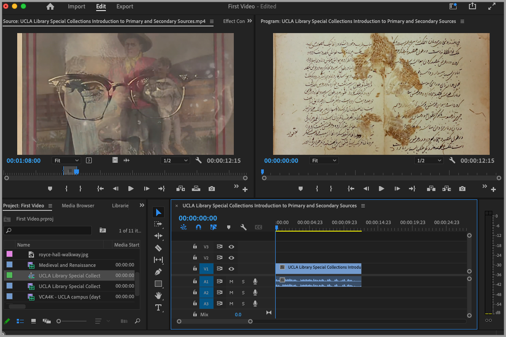

Now that you've marked your clip, click on its icon, drag it to the timeline panel, and release it.* You'll see that the section you marked now appears on the timeline, and it also plays in the program monitor window.

Repeat this process with another clip, dropping each clip onto the timeline at the end of the preceding clip. You'll notice that the clip "snaps" to the end of the preceding clip.

*You might be aware that video's parameters can vary widely (e.g., frame rate, aspect ratio, quality). The first clip you drop onto your timeline will set the parameters for your project. Each subsequent clip will be adapted to the first clip's properties.

# 10 Two ways to add clips

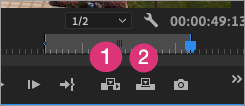

So far, we've been dragging and dropping our clips, adding each to the end of the preceding clip in order to form a sequence.

But you can also add clips to the middle of a sequence, either by **inserting** the clip or **overwriting** the sequence.

When you **insert** a clip, you add the footage at the moment you specify, and at the end of that clip, the sequence where you added the clip picks up right where it left off.

When you **overwrite** with a clip, the new footage plays instead of the older footage for the duration of the section you've marked.

You can try this by selecting a section of a source clip, using the **Mark in** and **Mark out** tools. Then, on the main timeline, position the playhead at the moment you'd like your new clip to play.

Now, in the source monitor, press the **Insert** button (**1**).

Press **command**-**z** to undo your last action (or, from the **Edit** menu, select **Undo**).

Now see what happens when you press the **Overwrite** button (**2**).

# 11 Working with the timeline panel

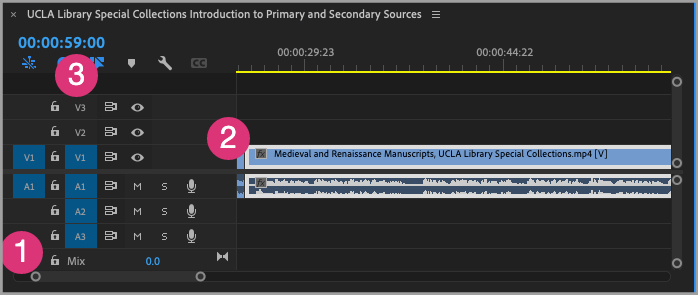

Let's investigate the timeline panel a little more closely.

First, take a look at the small circles at the bottom left (**1**). You can "magnify" the timeline or zoom out of it by dragging these circles closer or father apart. (You can also use the **=** and **-** keys to zoom in and out, and use the **/** key to show the whole sequence.)

Next, look at the timeline itself (**2**). You'll notice that your video is actually made up of two tracks: the solid-colored one is the image part of the video; the track that contains a waveform is the audio part of the track.

You can layer tracks on top of each other. For example, you could record a voiceover track and then lay it on top of a musical track, or you could superimpose a graphic on a video track. (Upper video tracks appear "on top of" lower video tracks, so you'd lay the graphic on the track above your video track.)

The track header, at the left of the timeline panel (**3**), contains controls that allow you to change the behavior of your tracks.

# 12 Make the video track taller

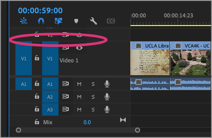

I find it easier to work with the video track when we increase its height. This allows you to view a thumbnail of the video on the track itself.

Move your cursor to the track head, positioning it in between the controls for **V1** and **V2** (the area circled in the image). The cursor will change shape. Drag the control upwards to increase the size of the video track, until you can see an image of the video on the track itself.

# 13 Mute audio tracks

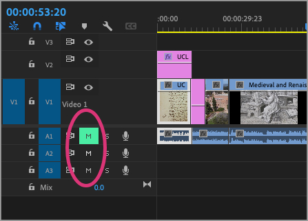

When I imported my video clips, I also imported the audio track. This makes for a confusing audio experience, so let's turn off the audio for each track.

For each audio track you'd like to mute, click the **M** in the relevant track control.

# 14 Insert a still image

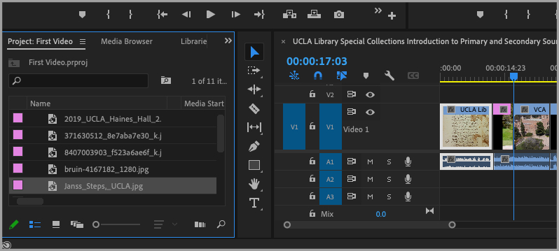

From your project panel at the left of your window, click on a still image and drag it to the timeline to drop into your video. You'll notice that photographs have a default duration, which you can change by dragging the borders of the image on the timeline.

(If you have a folder of images you'd like to import as a sequence, [here's](https://www.editvideofaster.com/premiere-pro-import-image-sequence/) a faster way to import them. [Here](https://www.filmeditingpro.com/the-editors-guide-to-working-with-still-images-in-premiere-pro/) is a more detailed walkthrough of Premiere's still-image editing features.)

# 15 Apply effects to an image (1)

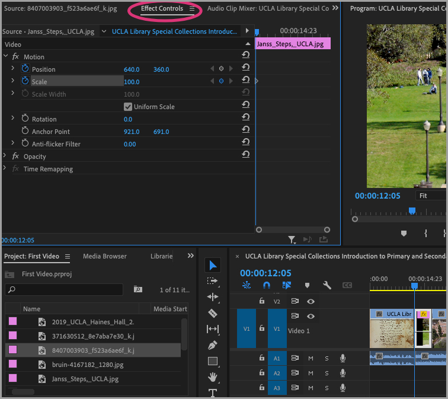

When we watched videos in this class, we noticed that filmmakers often applied motion effects to still images in order to make them more dynamic. We can do this in Premiere.

In the main timeline, move the playhead so that it's located on the image you inserted in the last step. Now, in the panel that contains the source monitor, select the **Effect controls** tab (circled in the accompanying image).

Now, the left side of the source monitor contains a list of effects. On the right side of the source monitor, you'll notice a mini-timeline that corresponds to the duration of the image in your video.

To apply an effect to our image, we'll need to set **keyframes** that tell Premiere when we want the effect to start and when we want the effect to end.

# 16 Apply effects to an image (2)

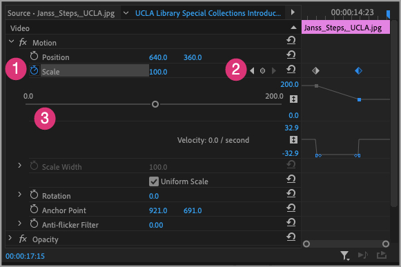

To animate an image, we'll indicate that we want to apply that effect by pressing the stopwatch button to the left of the effect name. Let's zoom in on our image to apply a "Ken Burns effect."

From the **Motion** list, click on the stopwatch to the left of **Scale** (1) to activate the effect. The stopwatch turns blue. Click on the arrow to the left of the stopwatch to reveal more options.

Now we'll add keyframes to indicate when we want the effect to begin and end. To the right of the effect name, you'll see a circle framed by two arrows (**2**).

To set our first keyframe, press the circle. Now, click somewhere else on the image's mini-timeline and click the circle again. This sets the second keyframe, to indicate where you want the scale effect to end.

Finally, using the scrubber below the word "Scale" (**3**), move the circle to the left or right to control how big or small your image will become during the animated sequence.

Press play on the main timeline to see your effect in action.

If you'd like, you can experiment with the other effects to see them in action. You can reset each item by clicking on the reset arrow just to the right of the keyframe controls.

You can read more about effects [here](https://helpx.adobe.com/premiere-pro/using/adding-navigating-setting-keyframes.html).

# 17 Add a title (1)

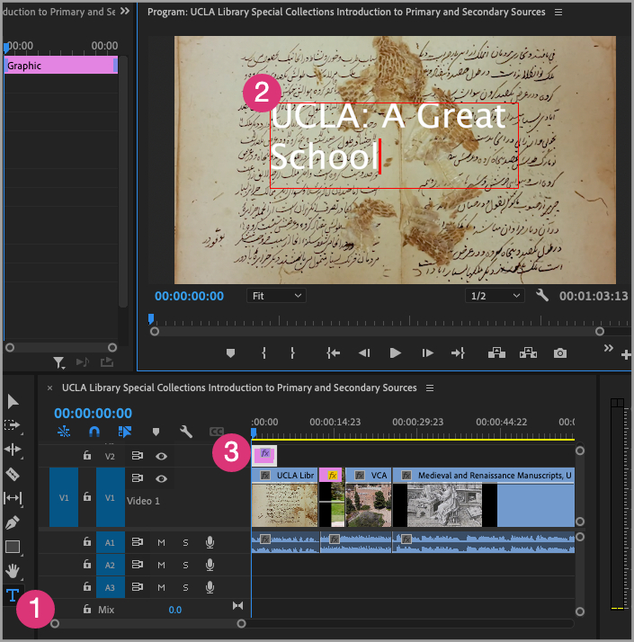

You can add titles or captions to your video either by superimposing them on an image or by setting them to play on their own.

To layer a title on an image, start by clicking on the **Text** button to the right of the track controls (**1**). 

Now, draw a bounding box on the image in the program monitor (**2**) to indicate the size and position of your title. Enter your title.

Notice that a title layer has appeared on the timeline (**3**). Double-click it to reveal more options for your title.

# 18 Add a title (2)

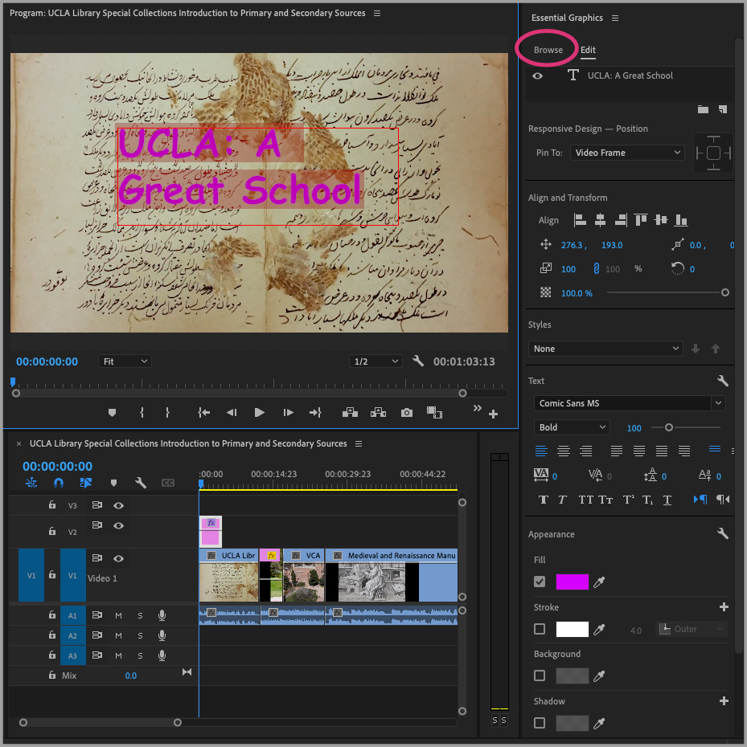

Once you've double-clicked on the text layer of your timeline, the Essential Graphics panel opens to provide you with more options. (If you can't see all of the options shown, try resizing your window to reveal more.)

You can change the font, color, and position of your title.

You can also change the duration of your title by dragging the borders of its track on the timeline to the left or the right.

If you click on the **Browse** tab in the Essential Graphics panel (circled in the accompanying image), you'll see that you can also choose to work with preset title options.

# 19 Add a title on its own

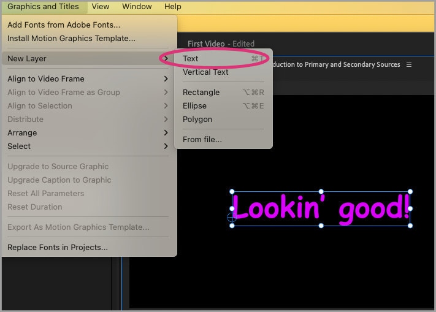

To add a title to a blank video layer, move the playhead to a blank spot on your main timeline. Then, either use the text tool or, from the **Graphics and Titles** menu, select **New Layer** and then **Text**.

You can move your title track around the same way as you did a video layer.

You can read more about titles, including how to make animated titles, [here](https://creativecloud.adobe.com/cc/discover/article/easily-add-animated-titles-with-premiere-pro?locale=en).

# 20 Add an audio track

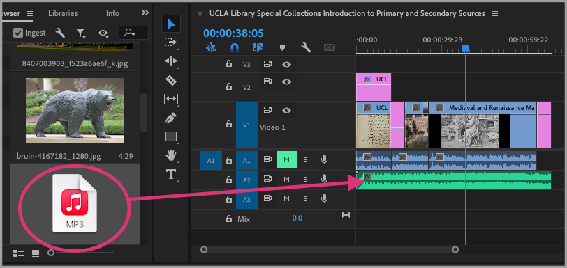

We'll talk more about audio next week, but for now, let's add an audio track to play under our video.

Select an audio track from your media library in your project panel. Drag it onto the timeline and drop it. You can change where it starts or stops or its duration by moving the track or changing its borders.

# 21 Export your video

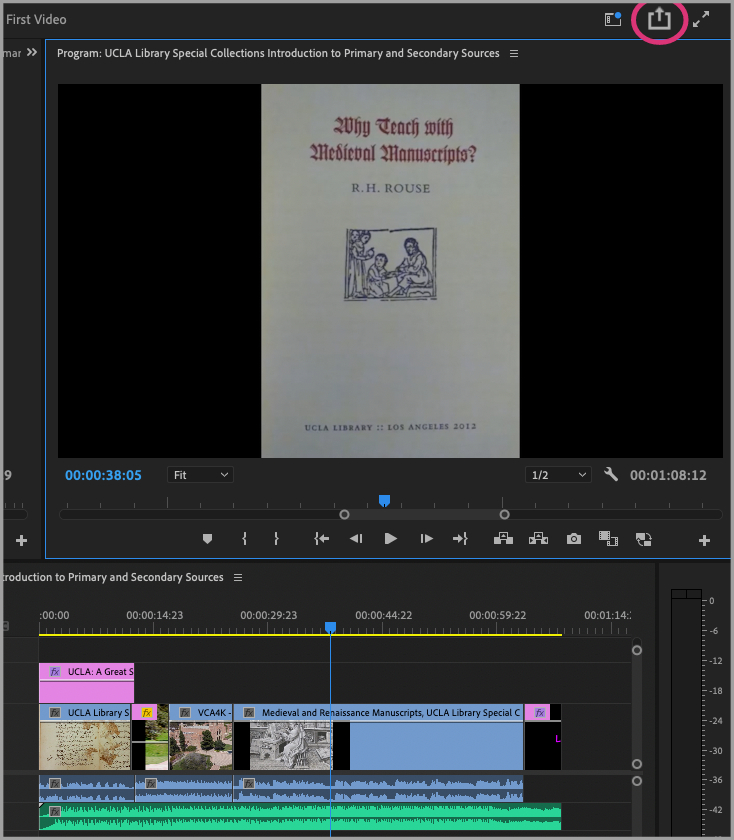

Up until this point, you've been creating an Adobe Premiere Project file. You can save the file and return to working with it in the editor, but you can't send it to friends or upload it to social media because it just links to the media files on your computer; it hasn't ingested them. 

But when you're ready, you'll want to export the project as a video. Premiere Pro offers lots of ways to customize the export, but for now, let's use the Quick Export option.

With the sequence open in the program monitor window, click on the **Quick Export** button at the top right of the window. You can change the file name or location. Premiere chooses an appropriate export format for you.

When you're ready, click the blue **Export** button. Now you're ready to enjoy your video and show it off to friends and family!

